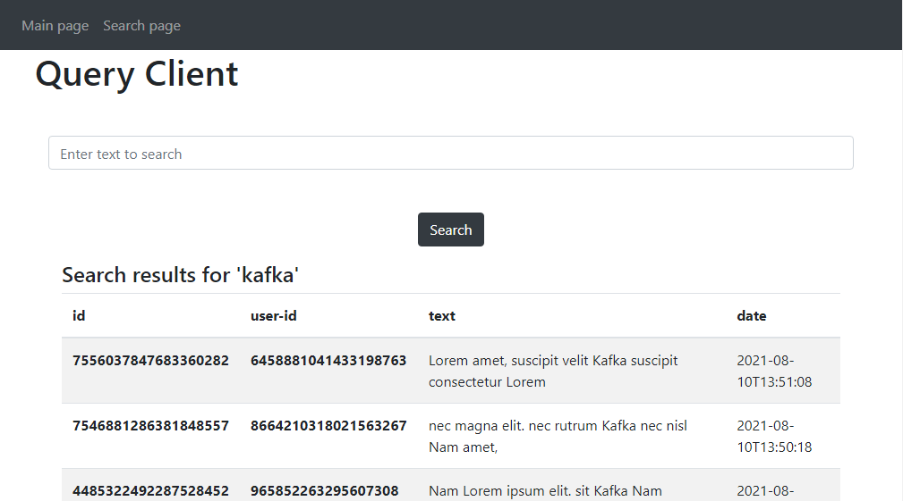

Twitter Micro Demo
============
[](https://opensource.org/licenses/MIT)
[](https://www.linkedin.com/in/micha%C5%82-%C4%87wi%C4%99ka%C5%82a-55b3a4118/)

## Table of contents
* [General info](#general-info)
* [Technologies](#technologies)
* [Setup](#setup)
* [Postman](#postman)
* [Architecture](#Architecture)
* [License](#License)

## General info
This project was created to learn basic microservice concepts. 
It uses Twitter Connector to search for tweets with some keywords, pushes it to Kafka cluster and then stores it to Elasticsearch.

RESTful API is based on HATEOAS principles.

GUI is based on Thymeleaf 



> The project is based on 12 factor methodology
> https://12factor.net/

###### Swagger documentation
Good documented API is crucial to sucessfull comunication across different teams. I decided to use Swagger as a POC of elastic-query-service microservice
You can check it locally [here](http://localhost:8183/elastic-query-service/swagger-ui) (remember to change the password!):

###### API versioning
The big challange in distributed systems is to manage API changes. I decided to try 2 API approches. 

###### Reactive Streams
I decided to add reactive modules to see the changes from Twitter in real time. Right now there is blocking and reactive module in the same time, because it's in progress.
- `reactive-elastic-query-service` alternative to `elastic-query-service`
- `reactive-elastic-query-web-client`alternative to `elastic-query-web-client`

## Technologies
* Java 11
* Spring Boot
* Spring Cloud
* Kafka
* Elasticsearch
* Thymeleaf
* Docker
* Maven
	
## Setup
This project uses Spring Cloud CLI to encrypt configurations using  Java Cryptography Extension (JCE).  

The configurations are stored in [separate config repository](https://github.com/mcwiekala/config-server-repository).

This is a public repository because of demonstration purposes (normally it should be private). So there is no any login or password to protect access.

[Install SDKMAN](https://sdkman.io/install)

Create 2 password to replace:
* `your_jce_encryption_password` - stands for encryption password
* `your_password_here` - stands for password which will be encrypted

and run:
```
sdk install springboot 2.4.0
spring install org.springframework.cloud:spring-cloud-cli:2.2.3.RELEASE
spring encrypt your_jce_encryption_password --key 'pass'
```
Replace passwords in `bootstrap.yml` in each module.

e.g.
`spring.cloud.config.password: '{cipher}g2322df111gfdsfdsfdsfg565w465tydfgdfsgfdg64'`


Add `ENCRYPT_KEY` as an Environment Variable
```
export ENCRYPT_KEY='your_password_here'
```
install it locally using Docker:
```
$ mvnw clean install
$ cd ./docker-compose
$ docker-compose up -d
```

To run kafka and elastic cluster you can run:  
```
docker-compose -f common.yml -f kafka_cluster.yml -f elastic_cluster.yml up -d
```

###### Twitter Connector
By default tweets are generated based on Lorem Ipsum placeholders. To activate real tweets you have to:

Sign up to [Twitter Developer](https://developer.twitter.com/en)

and register this project

change properies in `services.yml`: 
```
TWITTER-TO-KAFKA-SERVICE_ENABLE-MOCK-TWEETS=true
```
You can change twitter configurations here. Changes will work only if you commit and push the changes!
```
config-client-twitter_to_kafka.yml
```
Create properties file for Twitter and add secrets:

`twitter-to-kafka-service\src\main\resources\twitter4j.properties`
```
oauth.consumerKey=
oauth.consumerSecret=
oauth.accessToken=
oauth.accessTokenSecret=
```

## Postman
Postman collection was created to check some functionality.
Import postman project from `/postman` to view the requests.

## Architecture
docs in progress...

## License
[MIT](https://choosealicense.com/licenses/mit/)